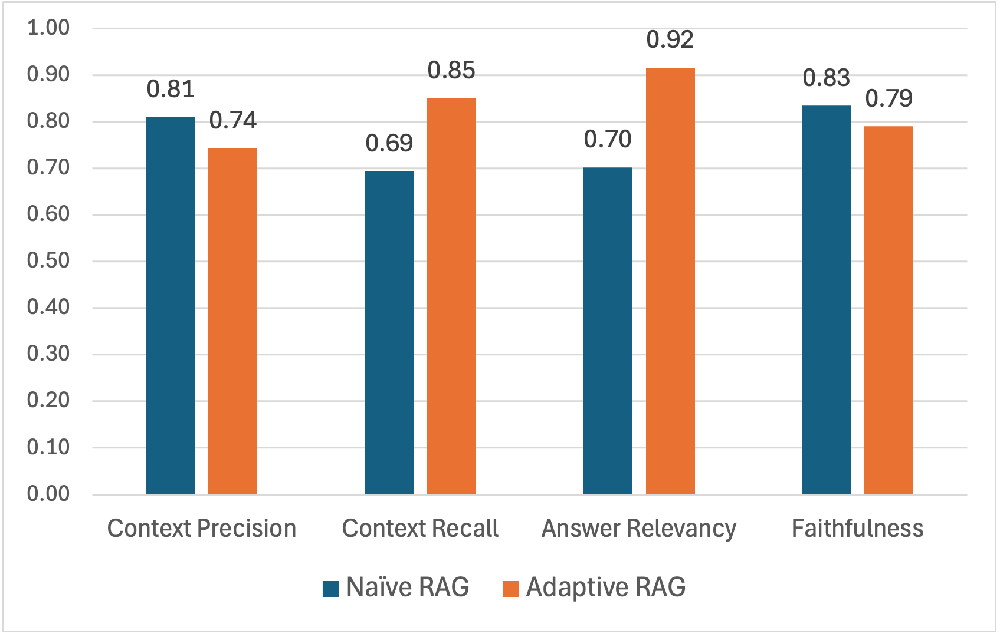

# Quantitative Finance RAG Agent
[](https://opensource.org/licenses/MIT)

An advanced AI agent leveraging **Adaptive RAG as a Service** and a **Child Graph architecture** to provide high-precision 
answers to complex quantitative finance queries.

<p style="text-align: center;">
  
</p>
<p style="text-align: center;"><em>Figure 1: User Interface</em></p>

------------------------------------------------------------------------

## 🚀 Key Features

Compared to a regular RAG workflow, this project introduces several
advanced architectural improvements.

### 1️⃣ Intention Identification First

Before retrieval begins, the agent classifies the user's input to
determine the appropriate workflow.

-   User input is classified prior to retrieval to modularize and
    optimize the answer generation process.
-   Intention categories are designed based on real CQF candidate
    discussion feedback.
-   Popular question types such as **comparison** and **calculation**
    are handled with customized workflows.
-   Simple inputs (e.g., greetings) are classified as **shortcut
    intentions**, served without consuming retrieval or LLM resources.
-   Out-of-domain questions (e.g., non finance) are classified as **fallback
    intentions**, returning a predefined decline message.

Final intention types:

-   `standard`
-   `comparison`
-   `calculation`
-   `shortcut`
-   `fallback`

------------------------------------------------------------------------

### 2️⃣ Adaptive RAG as a Service

The Adaptive RAG process is modularized as a standalone retrieval
service, including:

-   Document retrieval
-   Relevancy grading
-   Query rewriting
-   Web search fallback

This process operates independently of chat history or global state, **preventing "context pollution"** 
with **maximum scalability**:

-   **Standard intention** → 1 Adaptive RAG call\
-   **Comparison intention** → N+1 parallel Adaptive RAG calls to ensure comprehensive coverage.

------------------------------------------------------------------------

### 3️⃣ Child Graph & Multi-State Management

Built using **LangGraph**, the agent utilizes a nested graph structure.

**State isolation:**

-   Main Graph - for overall workflow orchestration including intention identification, hallucination check,
    answer generation, etc.
-   Child Graph (Adaptive RAG retrieval) - focusing purely on the question and document relevancy without the weight 
    of the main conversation's state nodes.

**Atomic processing for comparison questions:**

-   Decompose into N entity questions + 1 overall question
-   Execute N+1 child retrieval processes
-   Aggregate documents

------------------------------------------------------------------------

## 🏗️ Technical Architecture

The following diagram visualizes the LangGraph workflow, including the integration of child graphs in the light yellow boxes.


<p style="text-align: center;"><em>Figure 2: Adaptive RAG Workflow Architecture with Child Graph</em></p>

------------------------------------------------------------------------

## 📚 Data Source & Retrieval Design

-   **Retrieval data source:** 204 structured articles from **[Investopedia](https://www.investopedia.com/)**, 
    the world's leading source of financial content.
-   **Topics:** derivatives, portfolio theory, risk management, corporate
    finance, financial math, etc.
-   **Structure-Aware Chunking:**
    - Markdown-based parsing preserves levels of titles, paragraphs, bullet points, tables, lists,
      and LaTeX formulas as atomic blocks.
    - Logic: Chunks are capped at 1,400 characters. For narrative sections exceeding 1,800 characters,
      semantic chunking is applied to maintain thematic integrity.
-   **Hybrid Search:**  dense + sparse vectors stored in Milvus to capture both semantic meaning and keyword precision.

------------------------------------------------------------------------

## 📊 Evaluation & Performance

The agent was benchmarked against a **Naive RAG** (baseline) using a dataset of 50 multi-category finance questions.

Some out-of-scope questions e.g. asking for Russian options are intentionally included in the question-relevant set. 
This is to test how web-search can improve the performance for adaptive RAG, and whether hallucination will happen 
if no relevant documents cannot be retrieved for naive RAG.

*To see the full question-reference list, please visit `./evaluation/question_reference.py`.*

### Question Categories
| Category            | Description                | Sample Question                                                                                                                                         |
|:--------------------|:---------------------------|:--------------------------------------------------------------------------------------------------------------------------------------------------------|
| **Core (15)**       | Single basic concept check | "What is Net Present Value (NPV)?"                                                                                                                      |
| **Comparison (12)** | Multi-entity analysis      | "What is the difference between a call option and a put option?"                                                                                        |
| **Formula (5)**     | Formula only check         | "What is the formula for portfolio variance?"                                                                                                           |
| **Calculation (5)** | Math calculation           | "How is WACC calculated if the cost of equity is 10%, the cost of debt is 5%, equity weight is 60%, debt weight is 40%, and corporate tax rate is 20%?" |
| **Compound (8)**    | Cross-concept connectivity | "How does credit risk affect bond yields?"                                                                                                              |
| **Edge (5)**        | Advanced/Niche concepts    | "What is the purpose of a structured product?"                                                                                                          |

### Evaluation metrics

The evaluation was automated via **RAGAS** in the following 5 metrics and verified by human review.

- Context-precision: Quality of retrieval – whether the retrieved context contains only relevant information
- Context-recall: Completeness of retrieval – whether all necessary information to answer the question was retrieved.
- Answer-relevancy: Directness & usefulness – how well the answer addresses the user's actual question.
- Faithfulness: Hallucination control – whether the generated answer is supported by the retrieved.
- Answer-correctness: Overall factual accuracy – whether the answer matches ground-truth facts. This is also the most important metric.

### Key Results

Let's check the overall answer-correctness first:
<p style="text-align: center;">
  
</p>
<p style="text-align: center;"><em>Figure 2: Evaluation Result of Correctness</em></p>

**Observations:**
- **Superiority:** Adaptive RAG outperformed Naive RAG in all categories, with a significant **+0.17** margin in total score.
- **Complexity Handling:** The "Compound" and "Comparison" categories saw the largest gains (0.21–0.30), 
  proving the effectiveness of the child graph.
- **Math excellence:** For questions in Calculation, Adaptive RAG demonstrates exceptional capability (0.9 in correctness)
  to answer correctly with complicated math operations.
- **Recall vs. Precision:** While Adaptive RAG had slightly lower context precision (due to the child graph retrieving more documents),
  it achieved significantly higher **Recall**, ensuring that the LLM always had the necessary facts to prevent hallucination.
- **Small Gap for Straightforward Tasks**: For single concept checking, like Core and Edge, Adaptive RAG is only slight better than naive RAG with advantage under 0.1.

Then, let's observe the other 4 metrics in the result: 
<p style="text-align: center;">
  
</p>
<p style="text-align: center;"><em>Figure 4: Evaluation Result of Other Metrics</em></p>

**Observations:**
- **Lower Precision:** Adaptive RAG is not always better than naive RAG. In context precision, it is 0.07 lower, this is the cost of child graphs which will naturally retrieve more documents. But at the retrieval stage, low precision is not necessarily a bad thing.
- **High Recall:** As a result, Adaptive RAG has a much higher recall than naive RAG, this is delivered by both child graphs and the web-search feature, laying the foundation of the high correctness.
- **Good Relevancy**: Accordingly, Adaptive RAG has a strong relevancy due to the high recall, although more retrieved documents could be "wasted" compared to Naive RAG.
- **Similar Faithfulness:** Both of them are at a high level with little hallucination. The gap of 0.04 is not significant enough to decide a clear winner.

*For the detailed performance result, please visit `./evaluation/eval_results_adaptive_rag.xlsx` and `./evaluation/eval_results_naive_rag.xlsx`.*

------------------------------------------------------------------------

## 🛠️ Tech Stack

- **Workflow Orchestration:** [LangGraph + LangChain](https://www.langchain.com/langgraph)
- **Vector Database:** [Milvus](https://milvus.io/) (via [Docker](https://www.docker.com/))
- **Web Search:** [Tavily](https://www.tavily.com/)
- **GUI:** [Gradio](https://www.gradio.app/)
- **Evaluation framework:** [RAGAS](https://www.ragas.io/)
- **Models:** 
    * **Embedding:** [Qwen3-Embedding-0.6B](https://huggingface.co/Qwen/Qwen3-Embedding-0.6B)
    * **Inference:** [Qwen-plus](https://qwen-ai.chat/models/qwen-plus/)
    * **Evaluator:** [GPT-4.1](https://developers.openai.com/api/docs/models/gpt-4.1)

------------------------------------------------------------------------

## ⚙️ Getting Started

### Prerequisites
1.  **Docker:** Required for [running Milvus Standalone](https://milvus.io/docs/install_standalone-docker-compose.md).
2.  **Python 3.11:** Recommended environment.
3.  **API Keys:** AliCloud (Qwen), OpenAI, and Tavily.

### Installation & Setup
1.  **Clone the Repository:**
    ```bash
    git clone [https://github.com/lituokobe/Quantitative-Finance-RAG.git](https://github.com/lituokobe/Quantitative-Finance-RAG.git)
    cd Quantitative-Finance-RAG
    ```
2.  **Install Dependencies:**
    ```bash
    pip install -r requirements.txt
    ```
3.  **Configure Environment:**
    Rename `.env.example` to `.env` and input your API keys.
4.  **Download Local Models:**
    Place the [`Qwen3-Embedding-0.6B`](https://huggingface.co/Qwen/Qwen3-Embedding-0.6B) files in `./models/Qwen3-Embedding-0.6B/`.
5.  **Data Ingestion:**
    Deploy Milvus Standalone, then run:
    ```bash
    python ./documents/ingest_with_milvus_db.py
    ```
    This is to ingest both sparse and dense vectors of the finance article chunks to Milvus. 
    If you have Attu, the GUI of Milvus, you should see a new collection of `quantitative_finance_rag` created.
6.  **Launch the Agent:**
    To use the GUI:
    ```bash
    python ./agent_adaptive_rag/adaptive_rag_langgraph_agent_GUI.py
    ```
    Optionally, try the naive RAG agent with GUI:
    ```bash
    python ./agent_naive_rag/naive_rag_langgraph_agent_GUI.py
    ```