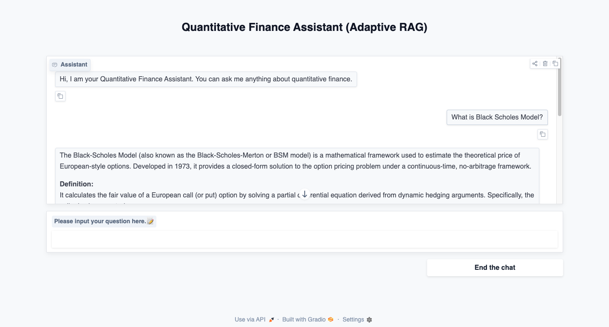
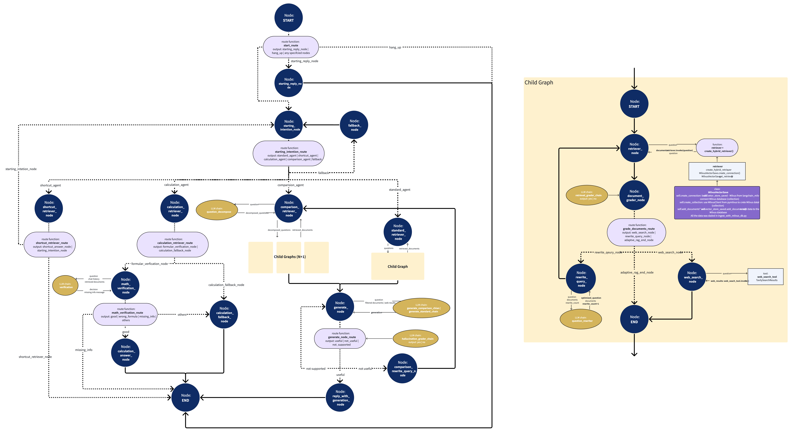
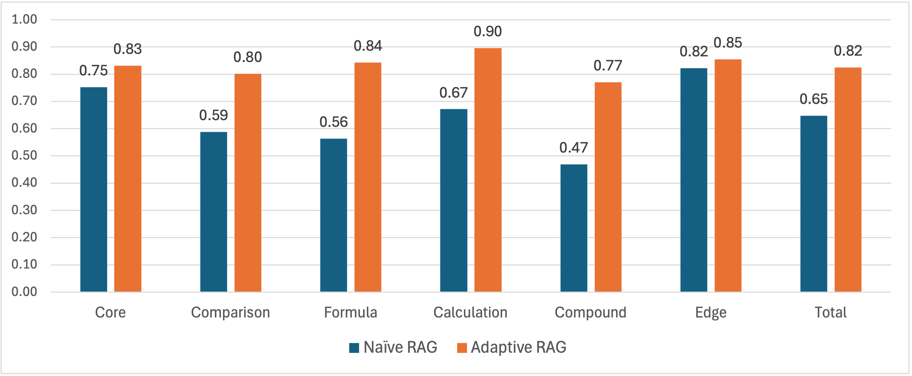

# Quantitative Finance Adaptive RAG Agent

An advanced AI agent leveraging **Adaptive RAG as a Service** and **Child Graph** architectures to provide high-precision answers 
to complex quantitative finance queries.

<p align="center">
  
  <br>
  <em>Figure 1: User Interface developed with Gradio</em>
</p>

---

## 🚀 Core Features

Unlike standard RAG workflows, this agent implements several advanced design patterns to ensure accuracy, efficiency, and cost-effectiveness.

### 1. Multi-Stage Intention Identification
Before any retrieval occurs, the agent classifies user intent to determine the optimal workflow. This modular approach minimizes LLM latency and resource consumption.
* **Standard:** Concept-based queries requiring high-fidelity retrieval.
* **Comparison:** Requires multi-entity analysis via child graphs.
* **Calculation:** Specialized for mathematical derivation and formula application.
* **Shortcut:** Common greetings or "How-to" questions served via pre-configured responses (zero retrieval cost).
* **Fallback:** Filters out-of-scope or non-finance content gracefully.

### 2. Adaptive RAG as a Service
The retrieval, grading, query rewriting, and web-search logic are decoupled from the main workflow. 
* **Modularization:** The retrieval process operates independently of chat history or global state, preventing "context pollution."
* **Scalability:** For comparison questions involving $N$ entities, the system launches $N+1$ parallel retrieval services to ensure comprehensive coverage.

### 3. Child Graphs & Multi-State Management
Developed with **LangGraph**, the agent utilizes a nested graph structure.
* **State Isolation:** The Adaptive RAG child graph maintains its own state, focusing purely on the question and document relevancy without the weight of the main conversation's state nodes.
* **Atomic Processing:** Comparison queries are decomposed into atomic sub-questions. Each sub-question is processed by the child graph, and the results are aggregated for final hallucination-checked generation.

---

## 🏗️ Technical Architecture

The following diagram visualizes the LangGraph workflow, including the integration of the light yellow child graph nodes.


<p align="center"><em>Figure 2: Adaptive RAG Workflow Architecture with Child Graph</em></p>


### Data Engineering & Retrieval
* **Source:** 204 specialized articles from **Investopedia**, covering derivatives, portfolio theory, and risk management.
* **Structure-Aware Chunking:**
    * Markdown-based parsing preserves tables, lists, and LaTeX formulas as atomic blocks.
    * **Logic:** Chunks are capped at 1,400 characters. For narrative sections exceeding 1,800 characters, semantic chunking is applied to maintain thematic integrity.
* **Hybrid Search:** Implemented in **Milvus** using both dense and sparse vectors to capture both semantic meaning and keyword precision.

---

## 📊 Evaluation & Performance

The agent was benchmarked against a **Naive RAG** (baseline) using a dataset of 50 multi-category finance questions.

### Question Categories
| Category | Description | Sample Question |
| :--- | :--- | :--- |
| **Core** | Single basic concept check | "What is Net Present Value (NPV)?" |
| **Comparison** | Multi-entity analysis | "Difference between a call and put option?" |
| **Calculation** | Formula application | "Calculate WACC given cost of equity is 10%..." |
| **Compound** | Cross-concept connectivity | "How does credit risk affect bond yields?" |
| **Edge** | Advanced/Niche concepts | "What is the purpose of a structured product?" |

### Key Results
The evaluation was automated via **RAGAS** and verified by human review.

<p align="center">
  
  <br>
  <em>Figure 3: Accuracy comparison across question types</em>
</p>

**Observations:**
* **Superiority:** Adaptive RAG outperformed Naive RAG in all categories, with a significant **+0.17** margin in total score.
* **Complexity Handling:** The "Compound" and "Calculation" categories saw the largest gains (0.21–0.30), proving the effectiveness of the child graph for multi-step reasoning.
* **Recall vs. Precision:** While Adaptive RAG had slightly lower context precision (due to the child graph retrieving more documents), it achieved significantly higher **Recall**, ensuring that the LLM always had the necessary facts to prevent hallucination.

---

## 🛠️ Tech Stack

* **Orchestration:** [LangGraph + LangChain](https://www.langchain.com/langgraph)
* **Vector Database:** [Milvus](https://milvus.io/) (via Docker)
* **Web Search:** [Tavily](https://www.tavily.com/)
* **GUI:** [Gradio](https://www.gradio.app/)
* **Models:** * **Embedding:** `Qwen3-Embedding-0.6B`
    * **Inference:** `Qwen-plus`
    * **Evaluator:** `GPT-4.1` (via RAGAS)

---

## ⚙️ Getting Started

### Prerequisites
1.  **Docker:** Required for running Milvus Standalone.
2.  **Python 3.11:** Recommended environment.
3.  **API Keys:** AliCloud (Qwen), OpenAI, and Tavily.

### Installation & Setup
1.  **Clone the Repository:**
    ```bash
    git clone [https://github.com/lituokobe/Quantitative-Finance-RAG.git](https://github.com/lituokobe/Quantitative-Finance-RAG.git)
    cd Quantitative-Finance-RAG
    ```
2.  **Install Dependencies:**
    ```bash
    pip install -r requirements.txt
    ```
3.  **Configure Environment:**
    Rename `.env.example` to `.env` and input your API keys.
4.  **Download Local Models:**
    Place the `Qwen3-Embedding-0.6B` files in `./models/Qwen3-Embedding-0.6B/`.
5.  **Data Ingestion:**
    Deploy Milvus Standalone, then run:
    ```bash
    python ./documents/ingest_with_milvus_db.py
    ```
6.  **Launch the Agent:**
    To use the GUI:
    ```bash
    python ./agent_adaptive_rag/adaptive_rag_langgraph_agent(GUI).py
    ```

---

## 📜 License

This project is licensed under the **MIT License**.

```text
MIT License

Copyright (c) 2026 [Your Name/GitHub Username]

Permission is hereby granted, free of charge, to any person obtaining a copy
of this software and associated documentation files (the "Software"), to deal
in the Software without restriction, including without limitation the rights
to use, copy, modify, merge, publish, distribute, sublicense, and/or sell
copies of the Software, and to permit persons to whom the Software is
furnished to do so, subject to the following conditions:

The above copyright notice and this permission notice shall be included in all
copies or substantial portions of the Software.

THE SOFTWARE IS PROVIDED "AS IS", WITHOUT WARRANTY OF ANY KIND, EXPRESS OR
IMPLIED, INCLUDING BUT NOT LIMITED TO THE WARRANTIES OF MERCHANTABILITY,
FITNESS FOR A PARTICULAR PURPOSE AND NONINFRINGEMENT. IN NO EVENT SHALL THE
AUTHORS OR COPYRIGHT HOLDERS BE LIABLE FOR ANY CLAIM, DAMAGES OR OTHER
LIABILITY, WHETHER IN AN ACTION OF CONTRACT, TORT OR OTHERWISE, ARISING FROM,
OUT OF OR IN CONNECTION WITH THE SOFTWARE OR THE USE OR OTHER DEALINGS IN THE
SOFTWARE.